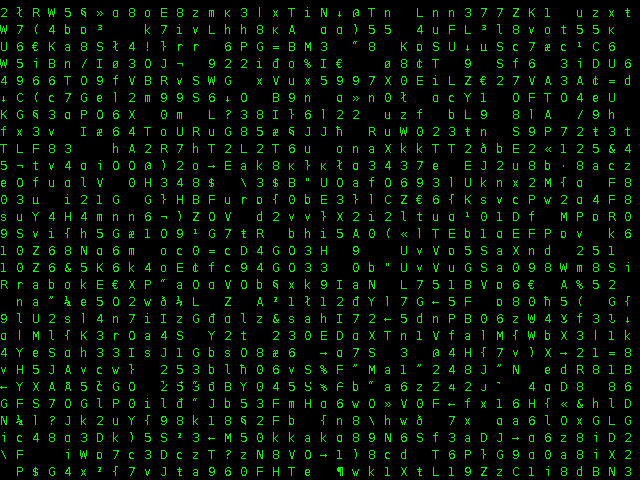

Description
===========

_This program is not a production-quality screensaver._

This repository provides a basic Matrix-style screensaver which can be stopped
by pressing Enter. Additionally, script `matrix_screensaver_img` allows
images of this style to be generated e.g. for use as background images.

Note that this was mainly written for educatorial purposes. Today, it can serve
as a quick 2D graphics test. The code contains use for some advanced Java
features: Making a screenshot of the current display and changing the monitor's
resolution.

See also: `cmatrix(1)`

Invocation
==========

Start the screensaver with `matrix_screensaver -c`. If `-c` is left out, it
attempts to change the screen resolution to 640x480 (for additional
nostalgia...) while running the screensaver.

Start the image generation with `matrix_screensaver_img` to obtain file
`matrix-desktop.png`. Note that it only works for single-monitor use cases.
